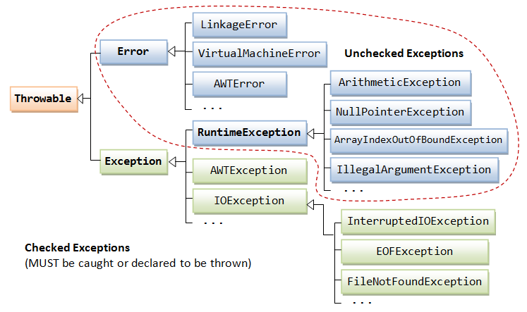

# Clean Code, Refactoring and Design Patterns

> This is a Java course focussing on how to write clean, maintainable and defensive code. It also covers
> best practices for refactoring, SOLID design principles and design patterns.

Tools used:

- JDK 11
- Maven
- JUnit 5, Mockito
- IntelliJ IDE

## Table of contents

1. Clean code
    - Good Names
    - Good Constructors
    - Good Methods
    - Good Exceptions
    - Good Class organization
2. Cleaner code with defensive coding
3. Refactoring
4. SOLID design principles
5. Design patterns

---

### Chapter 01. Clean Code

Bad code:

```
Calendar c = Calendar.getInstance();
c.set(123, 5, 26, 0, 0, 0);
c.add(13, 60); // adds one minute
new Service().wish(c.getTime()); // Fri Jun 26 00:01:00 CST 123
```

Clean code:

```
final LocalDate birthdayDate = LocalDate.of(2023, Month.JUNE, 26);
final LocalTime birthdayWishTime = LocalTime.of(0, 1, 0); // hh:mm:ss
new BirthdayWishService().wish(LocalDateTime.of(birthdayDate, birthdayWishTime)); // 2023-06-26T00:01:00
```

"The best programs are written so that computing machines can perform them quickly and so that human beings can
understand them clearly." ~ **Donald Knuth**

"Any fool can write code that a computer can understand. Good programmers write code that humans can understand."
~ **Martin Fowler**

"We are constantly reading old code as part of the effort to write new code... Therefore, making it easy to read makes
it easier to write." ~ **Robert Martin**

"Always code as if the guy who ends up maintaining your code will be a violent psychopath who knows where you live."
~ **John Woods**

**Dirty code consequences**

- More bugs: as the code is not testable
- Decreased productivity: as the code is not maintainable
- Lower job satisfaction: more time spent on reading or understanding the code and solving production issues rather than
  writing real good development projects

#### Good Names

Following good naming conventions can go a long way in making our code readable and maintainable.

Bad naming example:

```java
class CommonService { // what does this service do?
    Map<Integer, String> data; // what kind of data?

    public Map<String, String> data() { // get data?
        //....
    }
}
```

> Class names

Classes and objects should have **noun** or noun phrase names. A class name should NOT be a verb. For ex: Customer, Dog,
House, WikiPage, Account, AddressParser, OrderAlgo, EmailSender etc.

It should be **specific** as well.

For example, class `CommonUtils` contains util methods for "anything" (number, String, time, etc.), and it is too broad.

```java
import java.time.Instant;
import java.time.ZoneId;
import java.util.concurrent.ThreadLocalRandom;

public class CommonUtils {

    // number utils
    public static double getSquareRootPlusOne(final double num) {
        return Math.sqrt(num) + 1D;
    }

    public static int generateRandomNumberBetween(int low, int high) {
        return ThreadLocalRandom.current().nextInt(high - low) + low;
    }

    // String util
    public static String encode(final String data) {
        final StringBuilder builder = new StringBuilder();
        for (final char ch : data.toCharArray()) {
            builder.append(Character.isLetter(ch) ? ch ^ ' ' : ch);
        }
        return builder.reverse().toString();
    }

    // time util
    public static void printCurrentLocalTimeInUTC() {
        final String now = Instant.now().atZone(ZoneId.of("UTC")).toString();
        System.out.println(now);
    }

}
```

It breaks the **Single Responsibility Principle** rule which is basics of SOLID design principles. It states that a
class should only have one responsibility and should only have one reason to change.

So we should break down this class into subclasses with concrete good names: `NumberUtils`, `StringUtils`, `TimeUtils`.

```java
import java.util.concurrent.ThreadLocalRandom;

public class NumberUtils {

    public static double getSquareRootPlusOne(final double num) {
        return Math.sqrt(num) + 1D;
    }

    public static int generateRandomNumberBetween(int low, int high) {
        return ThreadLocalRandom.current().nextInt(high - low) + low;
    }
}
```

```java
public class StringUtils {

    public static String encode(final String data) {
        final StringBuilder builder = new StringBuilder();
        for (final char ch : data.toCharArray()) {
            builder.append(Character.isLetter(ch) ? ch ^ ' ' : ch);
        }
        return builder.reverse().toString();
    }

}
```

```java
import java.time.Instant;
import java.time.ZoneId;

public class TimeUtils {

    public static void printCurrentLocalTimeInUTC() {
        final String now = Instant.now().atZone(ZoneId.of("UTC")).toString();
        System.out.println(now);
    }

}
```

To summarize, avoid ending class names as: `Coordinator`, `Manager`, `Processor`, `Data`, or `Info` and always be more
specific.

Some alternatives are:

- Builder
- Factory
- Container
- Writer
- Reader
- Handler

There are quite a few design patterns used for creating objects: `Builder`, `Factory`,`Singleton`, etc.

Thus, we can use these patterns to create class names as:

```java
// OK, provides Order objects
class OrderFactory {
}
```

```java
// OK, builds a client with method chaining
class HttpClientBuilder {
}
```

> Variable names

Variables in Java capture the state of the object created from a class. The name of the variable should describe the
intent of the variable clearly.

Few guidelines to check:

- use camelCase (Java convention)
- always specific
- never a single letter, except in case of loops like `for` or `foreach`
- should be only 1-2 words, do NOT use very long variable names
- booleans should be prefixed with "is" or "has": **isActive**, **isInterrupted**, **hasCompleted**, etc.
- use ALL_CAPS with underscores for static constants

For ex:

```
Map<Integer, String> d = getStuff(); // single letter 'd' - what does it mean? => never use
Map<Integer, String> data = getStuff(); // what data?
Map<Integer, String> tradeDetails = getStuff(); // correct - tradeDetails clearly indicates that its about trades data 
```

> Method names

Few guidelines to check:

- name should reveal intent
- anyone can fully understand functionality from the name

In other words, if we have to look inside the method to understand what it does – the name needs improvement.

Taking the same snippet of code as above, we can rename the `getStuff()` method:

```
Map<Integer, String> tradeDetails = getTradeDetails();
```

As methods are actions, we can follow these conventions:

| Verb (do what?) | Noun (to what?) | Method Name (Verb + Noun) |
|-----------------|-----------------|---------------------------|
| get             | TradeDetails    | getTradeDetails()         |
| convert         | Currency        | convertCurrency()         |
| create          | Order           | createOrder()             |
| generate        | RandomNumber    | generateRandomNumber()    |

Few more checks while defining a method and its name:

- avoid abbreviations => `getKms()`, `calculateKgs()`, `setLbs()` - do NOT use this
- avoid spelling errors, otherwise, it will be difficult to search in a large project
- similar to classes, a method should do only one thing and should only have one reason to change
- if a method does MORE than the name says or if it has the name which contains "and", "or", "if" => it should be split
  into smaller methods

For ex:

```
TradeDetails getTradeDetails() {
    // query DB
    // format data
    // precalculate
    // convertToLocalCurrency
}
```

Here, `getTradeDetails()` method is doing 3 or more independent things but the name only says to get trade details.

Thus, we can easily split this method into multiple smaller methods.

- only query DB should be put in the `getTradeDetails()`
- new methods for `formatTradeData()`, `precalculateTradeData()`, `convertToLocalCurrency()`

Do NOT use this: `getAndFormatAndPrecalculateAndConvertToLocalCurrencyTradeData()`

There are few exceptions for method names as we just discussed:

- Static factory methods
- Builder and Fluent design patterns
- Java Streams

```
orderList.stream()
        .map(func1.andThen(func2))
        .findAny()
        .orElseThrow(...);
```

To summarize, naming classes, methods, variables, is one of the most important factors for writing clean code.

|           |                                    |
|-----------|------------------------------------|
| Classes   | Single Responsibility and specific |
| Variables | Descriptive and concise            |
| Methods   | Reveal intent and no multi-tasking |

#### Good Constructors

The most common way to create an object in Java is using `new` operator and call the constructor. Java constructors have
the same name as Class name. Sometimes it may be difficult to remember which constructor should be called if there are
overloaded constructors.

> Static factory methods

Thus, we can also have **static factory methods** instead of constructors with **meaning-full names** to return a new
object.

For ex: the following static factory method will return an unmodifiable collection object as the name says which is
clear and clean.

```
Collections.unmodifiableCollection(...);
```

Second advantage of static factory methods is that unlike constructors, they are NOT required to create a new object
each time they are invoked. This allows immutable classes to use pre-constructed instances or to cache instances as they
are constructed, and dispense then repeatedly to avoid creating unnecessary duplicates improving performance.

For ex: `Boolean.valueOf(boolean)` method never creates an object but just returns the pre-constructed
instances `Boolean.TRUE` or `Boolean.FALSE` instances.

```
    public static Boolean valueOf(boolean b) {
        return (b ? Boolean.TRUE : Boolean.FALSE);
    }
```

There are various static factory methods available in Java API, like:

```
Collections.unmodifiableCollection(...);
Collections.synchronizedCollection(...);
Path.of("src","test","resources","tmpFile");
Optional.empty();
String.valueOf(true);
LocalDate.of(2023, Month.JULY, 01);
```

> Constructor Chaining

Constructor chaining is the process of calling a sequence of constructors. We can do it in two ways:

- by using `this()` keyword for chaining constructors in the same class
- by using `super()` keyword for chaining constructors from the parent class

For ex: lets take an `Order` class.

```java
public class Order {
    protected final Long orderId;
    protected final String symbol;
    protected final Integer quantity;
    protected final String side;
    protected final String orderType;
    protected Double price;

    //getters, equals and hashcode
}
```

If `orderType` is **market** order, then `price` field is not needed - or, in other words, `price` field is
**optional**. Other fields are mandatory.

Thus, we can create 2 constructors:

```
public Order(final Long orderId, final String symbol, final Integer quantity, final String side, 
             final String orderType) {
    this(orderId, symbol, quantity, side, orderType, null); // orderType must be market order
}
```

```
public Order(final Long orderId, final String symbol, final Integer quantity, final String side, 
             final String orderType, Double price) {
    if("MKT_ORDER".equals(orderType) && price!=null) {
        throw new IllegalStateException("Market order can not have price");
    }
    // construct the object
}
```

Using `this()`, we are not duplicating the code for order type check and all checking is done at one place in the second
constructor => this is called **DRY** (**Don't Repeat Yourself**) principle.

Now let's create a child class of `Order`, which contains an extra field `msgType`.

```java
public class NewOrder extends Order {
    private final String msgType; // MsgType = 'D' for new order

    //getters, equals and hashcode
}
```

Let's create 2 constructors in a similar way as in the `Order` class:

```
public NewOrder(final Long orderId, final String symbol, final Integer quantity, final String side, 
                final String orderType, final String msgType) {
    this(orderId, symbol, quantity, side, orderType, null, msgType); // orderType must be market order
}
```

```
public NewOrder(final Long orderId, final String symbol, final Integer quantity, final String side, 
                final String orderType, Double price, final String msgType) {
    super(orderId, symbol, quantity, side, orderType, price);
    this.msgType = msgType;
    // construct the object
}
```

Chaining constructors makes code more readable. We don't have to repeat attribute assignments throughout all
constructors. Instead, we do this in one place.

> Constructor Telescoping

> Interview Problem 1 (Barclays): Explain Telescoping Constructor Pattern and how to resolve it.

Static factories and constructors share a limitation: they do not scale well to **large numbers** of optional
parameters. For ex: if we consider a class `Pizza` with several constructors:

```
Pizza(int size) { ... }        
Pizza(int size, boolean cheese) { ... }    
Pizza(int size, boolean cheese, boolean pepperoni) { ... }    
Pizza(int size, boolean cheese, boolean pepperoni, boolean bacon) { ... }
```

Only `size` is the **mandatory** field but all the other fields are **optional**.

Once constructors are 4 or 5 parameters long, it becomes difficult to remember the required **order of the parameters**
as well as what particular constructor we might want in a given situation.

It is hard to write client code when there are many parameters, and harder still to read it.

This is called the **Telescoping Constructor Pattern**.

Here comes the **Builder pattern** to rescue. Instead of making the desired object directly, the client calls a
constructor (or static factory) with all the **required** parameters and gets a **builder** object. Then the client
calls setter-like methods on the builder object to set each optional parameter of interest. Finally, the client calls a
parameterless build method to generate the object, which is typically **immutable**. The builder is typically a `static`
member class of the class it builds.

```java
// Builder Pattern
public class Pizza {

    private int size; // required
    private boolean cheese;
    private boolean pepperoni;
    private boolean bacon;

    public static class Builder {
        //required
        private final int size;

        //optional
        private boolean cheese = false;
        private boolean pepperoni = false;
        private boolean bacon = false;

        public Builder(int size) {
            this.size = size;
        }

        public Builder cheese(boolean value) {
            cheese = value;
            return this;
        }

        public Builder pepperoni(boolean value) {
            pepperoni = value;
            return this;
        }

        public Builder bacon(boolean value) {
            bacon = value;
            return this;
        }

        public Pizza build() {
            return new Pizza(this);
        }
    }

    private Pizza(Builder builder) {
        size = builder.size;
        cheese = builder.cheese;
        pepperoni = builder.pepperoni;
        bacon = builder.bacon;
    }

}
```

Code snippet to use builder pattern:

```
Pizza pizza = new Pizza.Builder(12)
                       .cheese(true)
                       .pepperoni(true)
                       .bacon(true)
                       .build();
```

This client code is easy to write and, more importantly, easy to read.

The `Pizza` class is **immutable**, and all parameter default values are in one place. The builder’s setter methods
return the builder itself so that invocations can be chained, resulting in a _fluent_ API.

#### Good Methods

Methods should be simple doing only one thing with no complexities. Often, lower complexity often means better code.

> Return empty collections or arrays, not nulls

For example: consider a method like this.

```
    public List<String> getSomeData() {
        try {
            // read from DB 
        } catch (Exception e) {
            // operation failed
            return null;
        }
    }
```

When the operation fails, it returns `null`. Now, the client code will suffer a lot - this method may lead to either
`NullPointerException` and client needs to discover it and handle it OR do lots of **null checks**: `if (list != null)`.
This will result in lots of code clutter and complexity, and we should avoid this.

Thus, instead of returning `null`, we should return `Collections.emptyList()`. If we were returning a set, we’d use
`Collections.emptySet()`; if we were returning a map, we’d use `Collections.emptyMap()`.

Similar care should be taken to NOT return some **magic numbers** like -1, 0, 1, etc. making the client code keep
guessing what does it mean.

**Bad method** returning -1 and 0 as magic numbers:

```
    public int withdraw(int amount) {
        if (amount > balance) {
            return -1;
        }
        else {
            balance -= amount;
            return 0;
        }
    }
```

**Clean method** throwing exception for insufficient balance:

```
    public void withdraw(int amount) throws IllegalStateException {
        if (amount > balance) {
            throw new IllegalStateException();
        }
        balance -= amount;
    }
```

Exceptions should be reserved for exceptional conditions. There is another approach to writing methods that may not be
able to return a value.

The `Optional<T>` class represents an immutable container that can hold either a single non-null `T` reference or
nothing at all.

A method that conceptually returns a `T` but may be unable to do so under certain circumstances can instead be declared
to return an `Optional<T>`. This allows the method to return an empty result to indicate that it could NOT return a
valid result. An Optional-returning method is more flexible and easier to use than one that throws an exception, and it
is less error-prone than one that returns null.

For ex: suppose we have a method as below:

```
    // Returns maximum value in collection - throws exception if empty
    public static <E extends Comparable<E>> E max(Collection<E> c) {
        if (c.isEmpty())
            throw new IllegalArgumentException("Empty collection");
        E result = null;
        for (E e : c)
            if (result == null || e.compareTo(result) > 0)
                result = Objects.requireNonNull(e);
        return result;
    }
```

This method throws an `IllegalArgumentException` if the given collection is empty. A better alternative would be to
return `Optional<E>`.

```
    // Returns maximum value in collection as an Optional<E>
    public static <E extends Comparable<E>> Optional<E> max(Collection<E> c) {
        if (c.isEmpty())
            return Optional.empty();
        E result = null;
        for (E e : c)
            if (result == null || e.compareTo(result) > 0)
                result = Objects.requireNonNull(e);
        return Optional.of(result);
    }
```

We use two: `Optional.empty()` returns an **empty** optional, and `Optional.of(value)` returns an optional containing
the given **non-null** value.

It is a programming error to pass null to `Optional.of(value)`. If we do this, the method responds by throwing
a `NullPointerException`. The `Optional.ofNullable(value)` method accepts a possibly **null** value and returns an empty
optional if null is passed in.

Never return a null value from an Optional-returning method: it defeats the entire purpose of the facility.

> Reduce number of arguments to maximum 3

Fewer method arguments are better and clean. Methods with more than 3 arguments means:

- method is doing more than 1 thing - split it
- take too many primitive types - wrap it into an object and pass that object instead
- takes a boolean flag - split it into 2 methods with each implemented for TRUE and FALSE

> Always validate the method arguments first before writing any method implementation

Before we should write any method implementation, at the very first line => we should validate the method arguments
passed. This will help to **fail-fast** if arguments are invalid.

For ex:

```
    public void withdraw(int amount) {
        if(amount <= 0) {
            throw new IllegalArgumentException("withdrawing amount can not be <= 0");
        } 
        // rest of the method 
    }
```

#### Good Exceptions

When used to best advantage, exceptions can improve a program’s readability, reliability, and maintainability. When used
improperly, they can have the opposite effect.

> Use exception for only exceptional conditions

For ex:

```
        final Mountain range[] = new Mountain[10];
        
        // Horrible abuse of exceptions. Don't ever do this!
        try {
            int i = 0;
            while (true)
                range[i++].climb();
        } catch (ArrayIndexOutOfBoundsException e) {
        }
```

The above bad code has an infinite loop which terminates by throwing, catching, and ignoring an
`ArrayIndexOutOfBoundsException` when it attempts to access the first array element outside the bounds of the array.

Thus, after the 10th element is accessed, for the 11th element - it will throw `ArrayIndexOutOfBoundsException` and
simply ignore and move out of it.

The same code could be written as:

```
        for (Mountain m : range)
            m.climb();
```

So, use exception for ONLY exceptional conditions => not for normal work flow.

> Do not catch or handle unchecked exceptions as these are programming errors. Instead, use checked exceptions for
> recoverable conditions and runtime exceptions for programming errors.



Java provides 3 kinds of throwables: checked exceptions, runtime exceptions (unchecked), and errors (unchecked).

The cardinal rule in deciding whether to use a checked or an unchecked exception is this: **Use checked exceptions for
conditions from which the caller can reasonably be expected to recover.**

By throwing a checked exception, we force the caller **to handle the exception in a catch clause** or to propagate it
outward.

For ex:

```
        File file = new File("myFile.txt");
        try (BufferedInputStream inputStream = new BufferedInputStream(new FileInputStream(file))) {
            // read a file
        } catch (IOException e) {
            //log.error(e);
        }
```

Here, `IOException` is a checked exception and compiler forces to handle it in try-catch block. But this is NOT a
programming error - it all depends on whether the file is present or not while we are reading it.

For all the pre-conditions we checked before, related to invalid arguments passed to a method or a constructor => these
are programming errors and should NOT be handled and code should fail to execute.

For ex:

```
    public void withdraw(int amount) {
        if(amount <= 0) {
            throw new IllegalArgumentException("withdrawing amount can not be <= 0");
        } 
        // rest of the method 
    }
```

Here, `IllegalArgumentException` is a `RuntimeException` (unchecked) and indicates a programming error - invalid
argument being passed to the method. Thus, caller of this method SHOULD get this exception back and SHOULD not be able
to execute the method with invalid arguments.

**Catch block**

Catch Block should NOT:

- be empty
- have only comments
- only print stack trace

Catch Block should:

- log the error
- throw new custom exception
- be specific - for ex, don't use just `Exception` class => use the specific exception class

```
// Bad code
catch { }
catch { // should never happen }
catch { return null; }
catch { e.printStackTrace(); }

// Clean code
catch { log.error(e); }
catch { throw new CustomException(e); }
```

**Finally block**

> Avoid exceptions in finally block

Exceptions should be thrown and handled in try-catch block. `finally` block is only intended to run the last code which
is ALWAYS supposed to run.

```
    public static void main(String[] args) {
        try {
            Object result = null;
            System.out.println(result.toString()); // NullPointerException
        } finally {
            cleanup();
        }
    }

    private static void cleanup() {
        throw new IllegalStateException();
    }
```

Output:

```
Exception in thread "main" java.lang.IllegalStateException
	at com.backstreetbrogrammer.ch01_cleancode.exceptions.FinallyDemo.cleanup(FinallyDemo.java:15)
	at com.backstreetbrogrammer.ch01_cleancode.exceptions.FinallyDemo.main(FinallyDemo.java:10)
```

Instead of throwing NPE, program is throwing `IllegalStateException` as `finally` block is overriding the actual
exception being thrown in the code.

> Always use try-with-resources, and then we can avoid using finally block

```
    void readFile() {
        try (Scanner scanner = new Scanner(new File("file.txt"))) {
            // read file
        } catch (final FileNotFoundException e) {
            // log the exception
        } // NO need of finally block to close the file
    }
```

In the above code snippet, there is no need to explicitly call the `finally` block to close the resources.

#### Good Class organization
